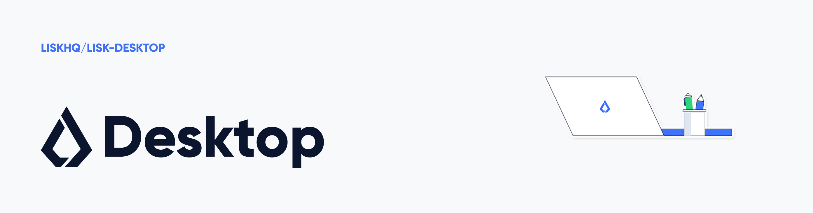

# Lisk Desktop

[](https://jenkins.lisk.com/job/lisk-desktop/job/development)
[](https://coveralls.io/github/LiskHQ/lisk-desktop?branch=development)
[](http://www.gnu.org/licenses/gpl-3.0)

[](https://deepscan.io/wallet#view=project&tid=6759&pid=8871&bid=113511)
[](https://github.com/LiskHQ/lisk-desktop/issues)


## Installation

You can download the latest release from [Lisk.com](https://lisk.com/wallet). The link automatically detects your operating system and downloads the correct app. Currently we are supporting the following operating systems:

- MacOS (individual builds for Apple Silicon and Intel chips)
- Windows
- Linux

## For Contributors

Please see [CONTRIBUTING_GUIDE.md](/docs/CONTRIBUTING_GUIDE.md) for more information.

## Development

### Using Commercial Fonts

`Basier Circle` and `Gilroy` used in the production version are commercial fonts. This repository only contains open fonts and uses `Open Sans` as a replacement for the commercial ones.

If you have licensed copies of `Basier Circle` and `Gilroy`, you can add them to [fonts folder](./src/assets/fonts). If you don't have the fonts, you need to remove lines 25 - 81 of [type.css](./src/components/app/type.css). After that, the `build` and `dev` yarn scripts run without any errors.

### Setup environment

The development environment currently depends on:

- [Node.js version 16 (lts/gallium)](https://nodejs.org/download/release/latest-v16.x/). The below instructions assume [nvm](https://github.com/nvm-sh/nvm) is being used to manage Node.js versions.
- [Python version 2.7.18 is required](https://www.python.org/downloads/release/python-2718/) is being used on encrypt/decrypt by the [lisk-sdk](https://github.com/LiskHQ/lisk-sdk/tree/development/sdk#dependencies).

_Note_:
For _Windows_ users, make sure to set the correct [msvs_version](https://www.npmjs.com/package/node-gyp#on-windows) config for installing and packing the Lisk Desktop application.

```
git clone https://github.com/LiskHQ/lisk-desktop.git
cd lisk-desktop
nvm use
yarn --cwd app && yarn
yarn run dev
```

Open http://localhost:8080 to access the wallet.

### Build

#### Production build

To build the project simply run

```
yarn run build
```

Under the hood, this script runs

```
yarn run build:prod
```

to build the React app under `src/` and

```
yarn run build:electron
```

to build the electron app under `app/` using webpack. You can run the above scripts individually if you're looking to see the changes solely on one of the two said applications.

### Run Electron

If you have already built the application as described above, you can launch Electron using

```
yarn run start
```

#### Run with parameters

To launch a version which supports hardware wallets, you can run

```
yarn run dev:hw
```

or to launch electron and receive live updates from already running `webpack-dev-server` on port `8080` and you can run

```
LISK_DESKTOP_URL="http://localhost:8080" DEBUG=true yarn run start
```

This comes with Redux dev tools.

### How to use the Ledger hardware wallet

Please see [HARDWARE_WALLET_DEVELOPMENT.md](/docs/HARDWARE_WALLET_DEVELOPMENT.md) for more information.

### Distribution

#### Windows

Build package for Windows (on Windows in [Git BASH](https://git-for-windows.github.io/)).

```
yarn run pack:win
```

#### macOS

Build package for macOS (on macOs)

```
yarn run pack
```

#### Linux

Build package for Linux (on Linux).

```
yarn run pack
```

## Testing

### Unit tests

#### Single run

```
yarn run test
```

#### Run each time a file changes

```
yarn run test:live
```

## Directory Layout

Note: The following layout structure may not appear exactly as shown below due to the legacy code/features. However, this is the layout that we try to follow:

```
├── .husky/                        # Contains a pre commit hook which checks that files are prettified before committing.
├── app/                           # Electron based application that launces the react app.
├── build/                         # Build specific materials.
├── coverage/                      # Results of Jest test coverage.
├── dist/                          # Platform specific built outputs.
├── docs/                          # Project documentation such as contribution guides and development guidelines.
├── libs/                          # Modules which can be consumed individually in other projects.
│   ├── hardwareWallet/            # HardwareWallet integrations.
│   ├── wcm/                       # Wallet connect.
├── node_modules/                  # 3rd-party libraries and utilities.
├── setup/                         # The top most application layer, contains MainRouter and globally imported css files.
│   ├── config/                    # Automation scripts (Webpack configurations, i18n scanner, etc.).
│   ├── react/                     # React presentational components are located here.
│   │   ├── app/                   # The bootstrap React application.
│   │   ├── assets/                # Static files (images, fonts, etc.).
├── src/                           # Application source code.
│   ├── const/                     # Static configurations and other values used throughout the application.
│   ├── locales/                   # Contains the built localization files.
│   ├── modules/                   # Divided logic in domain specific areas, an example structure is shown below.
│   │   ├── hardwareWallet/        # Module/Domain.
│   │       ├── __fixtures__/      # Contains mock data for the hardwareWallet module.
│   │       ├── components/        # Components related to the hardwareWallet domain.
│   │       ├── hooks/             # Hooks related to the hardwareWallet domain.
│   │       ├── store/             # Redux encapsulated logic related to the hardwareWallet domain.
│   │           ├── actions/       # HardwareWallet actions.
│   │           ├── selectors/     # HardwareWallet selectors.
│   │           ├── reducers/      # HardwareWallet reducers.
│   │       ├── utils/             # Utils used in the hardwareWallet module. Global utils should be put in src/utils.
│   ├── redux/                     # Contains the root reducer, all other reducers are imported here. It also has legacy pattern, selectors, and actions (these should now be encapsulated in its specific module).
│   ├── routes/                    # Contains all routes in the application as well as modals.
│   │   ├── routes.js              # Route and modal paths with metadata. This object is used in all our links.
│   │   ├── routesMap.js           # Maps components to routes, this is used in the MainRouter.js.
│   ├── service/                   # Add services, such as mock services.
│   ├── theme/                     # Themed components (Button, Input, etc.).
│   ├── utils/                     # Global utility functions used throughout the app.
        ├── i18n/                  # Localization setup.
└──test/                           # E2E tests written with Cypress.io and Cucumber; also some helpers used by unit tests that live in /src.
```

## Contributors

See [contributors section](https://github.com/LiskHQ/lisk-desktop/graphs/contributors).

## License

Copyright © 2016-2023 Lisk Foundation

This program is free software: you can redistribute it and/or modify it under the terms of the GNU General Public License as published by the Free Software Foundation, either version 3 of the License, or (at your option) any later version.

This program is distributed in the hope that it will be useful, but WITHOUT ANY WARRANTY; without even the implied warranty of MERCHANTABILITY or FITNESS FOR A PARTICULAR PURPOSE. See the GNU General Public License for more details.

You should have received a copy of the GNU General Public License along with this program. If not, see [http://www.gnu.org/licenses/.](http://www.gnu.org/licenses/)
