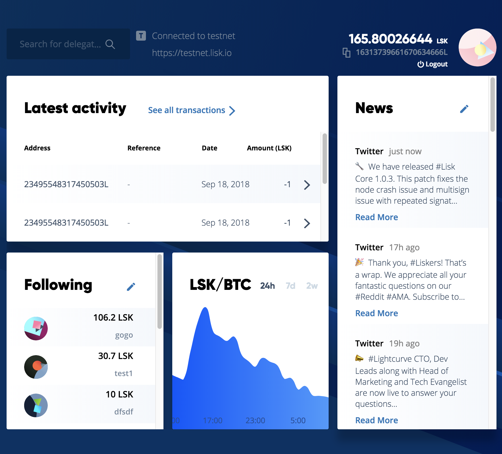
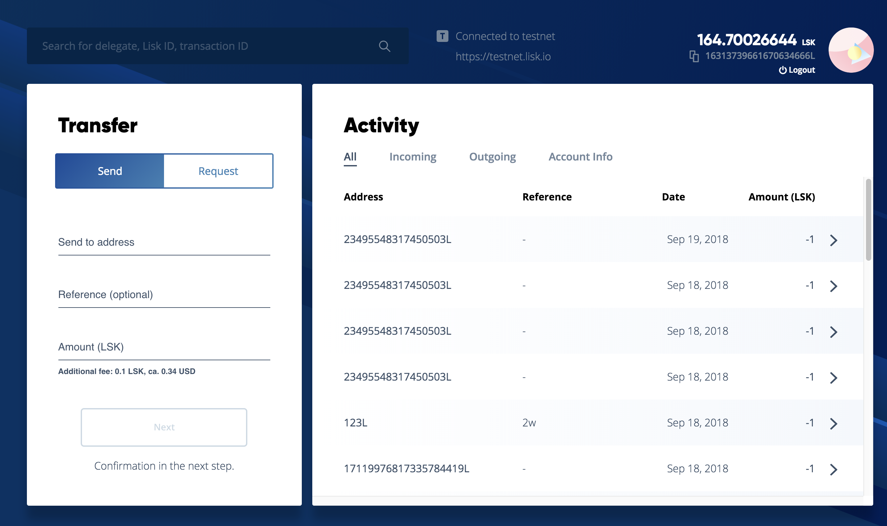
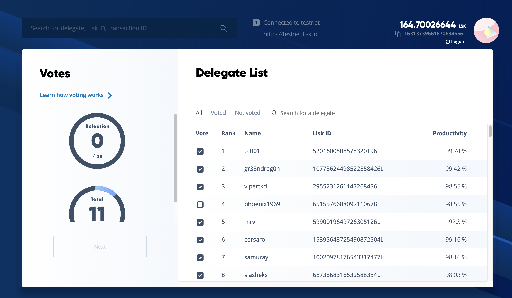
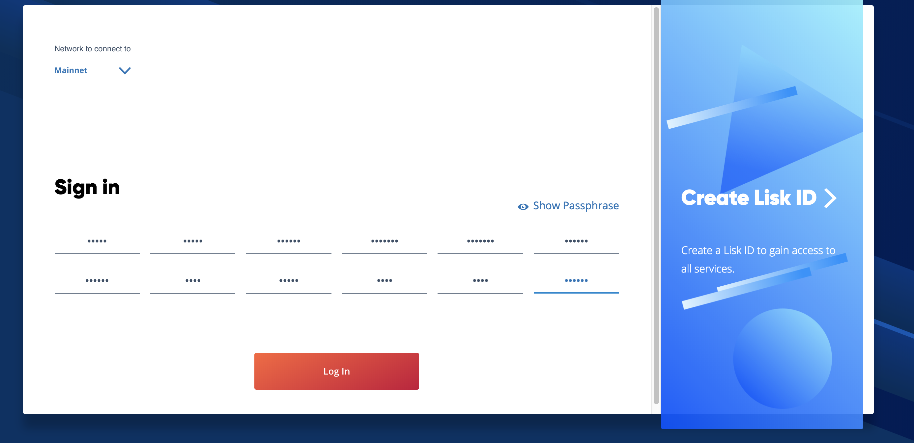
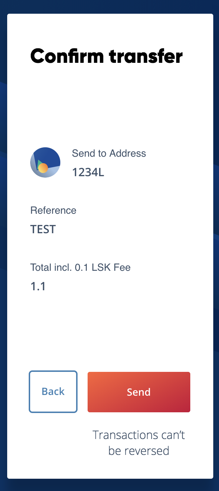
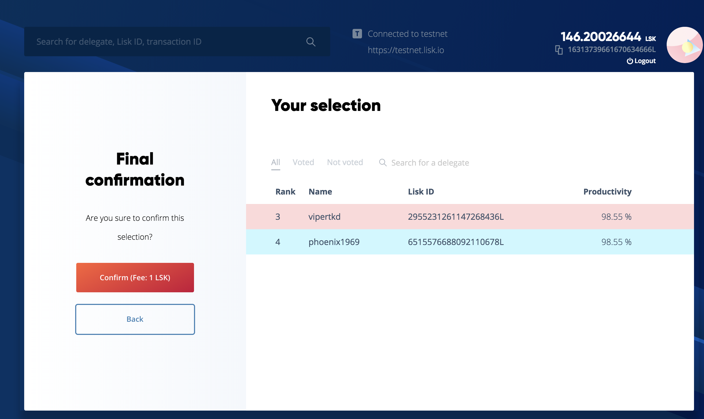
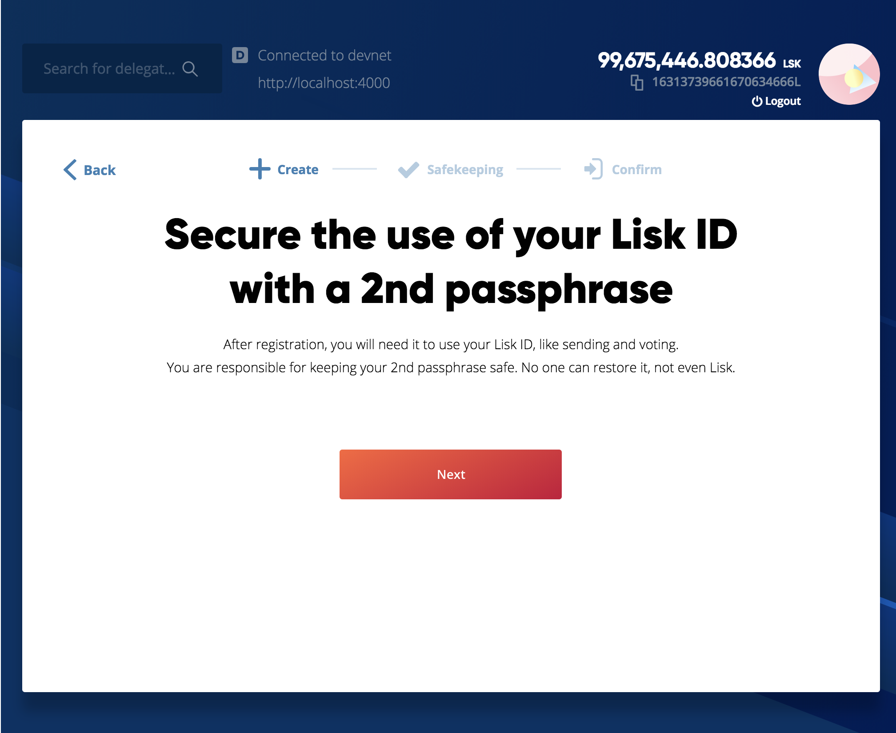
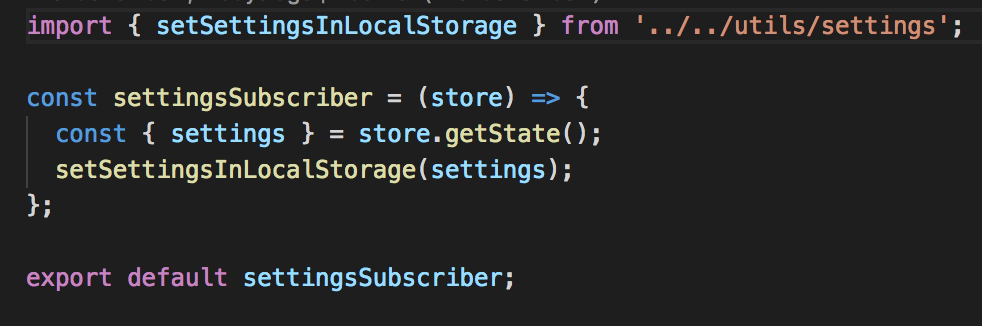

# Actions flow from user perspective
## Views action execution

## Dashboard

When entering actions execution:

| Module          |                    Function                 |
| --------------- |---------------------------------------------|
| Latest activity | [`loadTransactions()`](https://github.com/LiskHQ/lisk-hub/blob/e71527bd273af2f16d6980fe3b0c1a379694c45b/src/actions/transactions.js#L66)                        |
| News            | [`liskServiceApi.getNewsFeed()`](https://github.com/LiskHQ/lisk-hub/blob/a525a1c54510a45cf14a0a3c37be231ee316088b/src/utils/api/liskService.js#L29)              |
| Price chart     | [`liskServiceApi.getCurrencyGraphData(step)`](https://github.com/LiskHQ/lisk-hub/blob/a525a1c54510a45cf14a0a3c37be231ee316088b/src/utils/api/liskService.js#L7) |

## Wallet

When entering actions execution order:

1. [`TRANSACTIONS_FILTERED`](https://github.com/LiskHQ/lisk-hub/blob/e71527bd273af2f16d6980fe3b0c1a379694c45b/src/actions/transactions.js#L25)
2. [`ADD_FILTER`](https://github.com/LiskHQ/lisk-hub/blob/e71527bd273af2f16d6980fe3b0c1a379694c45b/src/actions/transactions.js#L35)
3. [`TRANSACTION_LOADED`](https://github.com/LiskHQ/lisk-hub/blob/e71527bd273af2f16d6980fe3b0c1a379694c45b/src/actions/transactions.js#L174)
4. [`ACCOUNT_ADD_VOTES`](https://github.com/LiskHQ/lisk-hub/blob/e71527bd273af2f16d6980fe3b0c1a379694c45b/src/actions/account.js#L74) fetching  *Account Info* voted accounts

On every tab change it executes `ADD_FILTER` action and reloading transactions except *Account Info*.

## Delegates

When entering actions execution order:

1. [`VOTE_LOOKUP_STATUS_CLEARED`](https://github.com/LiskHQ/lisk-hub/blob/e71527bd273af2f16d6980fe3b0c1a379694c45b/src/actions/voting.js#L65) -- Clear all voting data 
2. [`DELEGATES_ADDED`](https://github.com/LiskHQ/lisk-hub/blob/a525a1c54510a45cf14a0a3c37be231ee316088b/src/components/votingListView/index.js#L20) -- Adds first 100 delegates
3. [`VOTES_ADDED`](https://github.com/LiskHQ/lisk-hub/blob/d27796d57eb9246fae5876f02b242e6bb8343775/src/store/reducers/voting.js#L50) -- Adds voted delegates from account
4. [`VOTES_UPDATED`](https://github.com/LiskHQ/lisk-hub/blob/d27796d57eb9246fae5876f02b242e6bb8343775/src/store/reducers/voting.js#L118) -- Changes voted delegates status pending to false

## User scenarios action execution

## Login

After clicking `Log in` it executes:
- [`activePeerSet`](https://github.com/LiskHQ/lisk-hub/blob/86ab1874d89519a37d817c326c37d594f29b94eb/src/components/login/index.js#L28) with passphrase
  ↪️ Login Middleware 
  &nbsp;&nbsp;&nbsp;&nbsp;⬇️ [`getAccount`](https://github.com/LiskHQ/lisk-hub/blob/ea41bf3a898b2955de2d39e3a2bdd79ad150842e/src/store/middlewares/login.js#L31) 
  &nbsp;&nbsp;&nbsp;&nbsp;
  ↪️ Socket Middleware 
  &nbsp;&nbsp;&nbsp;&nbsp;&nbsp;&nbsp;&nbsp;&nbsp;⬇️ [`socketSetup`](https://github.com/LiskHQ/lisk-hub/blob/3793f0b0882309335a2ed3444b326ceebabd1bcf/src/store/middlewares/socket.js#L16) 

  ↪️ FollowedAccount Middleware 
  &nbsp;&nbsp;&nbsp;&nbsp;⬇️ [`followedAccountFetchedAndUpdated`](https://github.com/LiskHQ/lisk-hub/blob/a525a1c54510a45cf14a0a3c37be231ee316088b/src/store/middlewares/followedAccounts.js#L7) for each followed account
 

## Logout

After clicking `Logout` it executes:

- [`accountLoggedOut`](https://github.com/LiskHQ/lisk-hub/blob/6ca51a90d7c0f294022c2c2f3b3e371b4ff5fe74/src/store/reducers/account.js#L69) 
  ↪️ Socket Middleware 
  &nbsp;&nbsp;&nbsp;&nbsp;⬇️ [`closeConnection`](https://github.com/LiskHQ/lisk-hub/blob/3793f0b0882309335a2ed3444b326ceebabd1bcf/src/store/middlewares/socket.js#L8)
 

### Sending

After clicking `Send` it executes:
- Calls [`activePeer.transactions.broadcast(transaction)`](https://github.com/LiskHQ/lisk-hub/blob/e71527bd273af2f16d6980fe3b0c1a379694c45b/src/utils/api/transactions.js#L17) and then dispatches [`TRANSACTION_ADDED`](https://github.com/LiskHQ/lisk-hub/blob/2811c2be14fe5ab4ead3e4a375b20b67348fc191/src/store/reducers/transactions.js#L10)

### Delegates voting

After clicking `Confirm` it executes:
- Calls [`activePeer.transactions.broadcast(transaction)`](https://github.com/LiskHQ/lisk-hub/blob/e71527bd273af2f16d6980fe3b0c1a379694c45b/src/utils/api/delegate.js#L34) and then dispatches [`TRANSACTION_ADDED`](https://github.com/LiskHQ/lisk-hub/blob/2811c2be14fe5ab4ead3e4a375b20b67348fc191/src/store/reducers/transactions.js#L10)

On delegate select/uselect it executes:
- On Select -- [`voteToggled`](https://github.com/LiskHQ/lisk-hub/blob/d27796d57eb9246fae5876f02b242e6bb8343775/src/store/reducers/voting.js#L76) it adds to `voting.votes` redux new voted delegate object
- On UnSelect -- [`voteToggled`](https://github.com/LiskHQ/lisk-hub/blob/d27796d57eb9246fae5876f02b242e6bb8343775/src/store/reducers/voting.js#L76) it changes `voting.votes[toggledIndex]` delegate object unconfirmed property to `false`

## Register second passphrase

After going thru whole process and clicking `Confirm` it executes:
- Calls [`activePeer.transactions.broadcast(transaction)`](https://github.com/LiskHQ/lisk-hub/blob/e71527bd273af2f16d6980fe3b0c1a379694c45b/src/utils/api/transactions.js#L17) and then dispatches [`TRANSACTION_ADDED`](https://github.com/LiskHQ/lisk-hub/blob/2811c2be14fe5ab4ead3e4a375b20b67348fc191/src/store/reducers/transactions.js#L10)

## Socket
Socket connects on Login. Websocket listens to `blocks/change`
and every 10 seconds dispatches [`newBlockCreated`](https://github.com/LiskHQ/lisk-hub/blob/e71527bd273af2f16d6980fe3b0c1a379694c45b/src/store/reducers/blocks.js#L5) action.

- [`newBlockCreated`](https://github.com/LiskHQ/lisk-hub/blob/e71527bd273af2f16d6980fe3b0c1a379694c45b/src/store/reducers/blocks.js#L5) 
  ↪️ Account Middleware 
  &nbsp;&nbsp;&nbsp;&nbsp;⬇️ [`updateAccountData`](https://github.com/LiskHQ/lisk-hub/blob/77b6defdf98b6f67f005c25c28ea85378d375817/src/store/middlewares/account.js#L21) 
  &nbsp;&nbsp;&nbsp;&nbsp;⬇️ [`transactionsUpdated`](https://github.com/LiskHQ/lisk-hub/blob/77b6defdf98b6f67f005c25c28ea85378d375817/src/store/middlewares/account.js#L97) 
  &nbsp;&nbsp;&nbsp;&nbsp;&nbsp;&nbsp;&nbsp;&nbsp;↪️ Account Middleware 
  &nbsp;&nbsp;&nbsp;&nbsp;&nbsp;&nbsp;&nbsp;&nbsp;&nbsp;&nbsp;&nbsp;&nbsp;⬇️ [`votesFetched`](https://github.com/LiskHQ/lisk-hub/blob/77b6defdf98b6f67f005c25c28ea85378d375817/src/store/middlewares/account.js#L156) (sometimes) 
  &nbsp;&nbsp;&nbsp;&nbsp;&nbsp;&nbsp;&nbsp;&nbsp;&nbsp;&nbsp;&nbsp;&nbsp;⬇️ [`updateDelegateAccount`](https://github.com/LiskHQ/lisk-hub/blob/77b6defdf98b6f67f005c25c28ea85378d375817/src/store/middlewares/account.js#L155)  (sometimes) 
  ↪️ Followed Account Middleware 
  &nbsp;&nbsp;&nbsp;&nbsp;⬇️ [`followedAccountFetchedAndUpdated`](https://github.com/LiskHQ/lisk-hub/blob/a525a1c54510a45cf14a0a3c37be231ee316088b/src/store/middlewares/followedAccounts.js#L7) 

## Local Storage
  All data saved in localStorage should be saved in Subscribers files
  `store/subscribers`

  